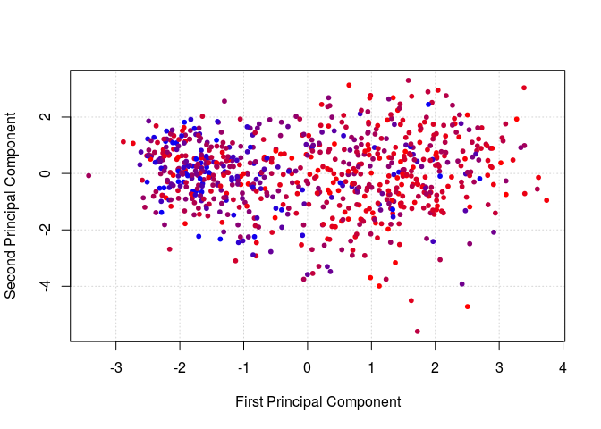

<!-- README.md is generated from README.Rmd. Please edit that file -->

# Work in progress

This package is currently in development. 

Recommended tutorials:

  * [Data preparation](docs/Data_preparation)
  * [Hub genes detection](docs/Hub_genes_detection)

## Installation

To install the package run:

```r
devtools::install_github("guillermo1996/CovCoExpNets")
```

<!---
For a more stable version, please visit [Carmen María Hernandez's version](https://github.com/carmen-maria-hernandez/SuCoNets).

## Modifications

The main modification to this package is the added option to create a model not by the best data partition (as done previously with the `bestSeed` function), but by selecting the genes that appear the most after running the `glmnet` algorithm several times (ten by default). This produces a set of genes in which the user can choose the minimum number of appearances for a gene to be chosen.

Let's see an example of this behavior. We first need an expression matrix previously treated with the `SuCoNets` pipeline and a covariate in the form of a numerical vector, also normalized following the instructions below. We start by running `geneSelection`, which produces a dataframe of the genes selected by `glmnet` and their frequency of appearance.  We then create the model by running `glmnetGenesSubset`.

``` r
genes.subset <- geneSelection(data, age, n = 5)
cvfit <- glmnetGenesSubset(data, age, genes.subset)
```

From this point forwards, we can continue to run the `SuCoNets` pipeline.

# SuCoNets

Nowadays, the way to create a co-expression network is to use
Hierarchical Clustering. This package allows you to create a
co-expression network using the glmnet algorithm. In addition, the
network created will be relative to a covariate of the sample to be
studied, so we are creating a supervised coexpression network.

## Installation

You can install SuCoNets like so:

``` r
devtools::install_github("guillermo1996/SuCoNets")
```

## Example

Suppose we have an expression matrix, data, where the columns are blood
samples and the rows are genes, so that each sample is identified by the
numerical values taken by the genes. Let us also assume that the
covariate we are going to study is the age of each individual to whom
each blood sample corresponds. This covariate is given as a numerical
vector, which we denote as age.

An example of a typical execution of the functions contained in this
package would be as follows.

We start by loading the package *SuCoNets*. Then, we normalize the age
with the function `normalize` and change to logarithmic scale,
centralize and normalize the expression matrix data with the function
`scn`. We also removed redundant predictors by invoking the function
`rRedundantPredictors`.

Note that the function `normalize` returns: first the mean of the vector
we pass as parameter, then its standard deviation and then the vector,
which we pass as parameter, normalized.

``` r
library(SuCoNets)
age <- normalize(age)
m <- age[1]
d <- age[2]
age <- age[-c(1,2)]
data <- scn(data)
data <- rRedundantPredictors(data)
```

Next, we calculate which seed produces the data partition (training set
and test set) that gives the best results when running `glmnet`
algorithm, so we can use that partition to run `glmnet` algorithm. With
the function detectGenes we get the genes that `glmnet` algorithm has
selected as important for age prediction

``` r
seed <- bestSeed(data,age)

cvfit <- glmnetGenes(data,age, seed)
glmnet::print.cv.glmnet(cvfit)
#> 
#> Call:  glmnet::cv.glmnet(x = data.train, y = covariate.train, alpha = 1,      family = "gaussian") 
#> 
#> Measure: Mean-Squared Error 
#> 
#>      Lambda Index Measure      SE Nonzero
#> min 0.03856    51  0.6071 0.03249      98
#> 1se 0.07747    36  0.6360 0.03471      27

selected.genes <- detectGenes(data,age,cvfit)
```

We can study the stability of the genes selected by the glmnet algorithm
with the function `stabilitySelection`. This function runs the glmnet
algorithm ten times by varying the input data set and saves the genes
that in each run glmnet selects as important for predicting the
covariate under study. As a result, for the genes we are going to work
with, this function shows the number of times that each of them has been
selected in the different executions. The interesting thing about this
function is to see the statistics of this selection, calling the summary
function to see the result of the execution. In addition, with the
function `histGeneFreq` we can plot a histogram with the number of genes
that appear once in the different runs, the genes that appear twice,
etc.

``` r
selection.statistics <- stabilitySelection(data, age, selected.genes)
summary(selection.statistics[,2])
#>    Min. 1st Qu.  Median    Mean 3rd Qu.    Max. 
#>   1.000   4.000   6.000   6.418   9.750  10.000
histGeneFreq(selection.statistics)
```


Now let’s look at a scatter plot with the predicted age and the actual
age of both the test set and the train set. Note that the mean and
standard deviation of the age must be passed as parameters to this
function to be able to see in the scatter plot the ages in the real
ranges.

``` r
comparisonActualPredictedCovariate(data, age, m, d, cvfit, seed)
#> `geom_smooth()` using formula 'y ~ x'
```


We can also obtain a representation of all individuals in the analysis
according to their age. Each individual will be represented by a dot.
The blue dots represent the youngest individuals and the red dots
represent the oldest. The individuals whose age is between these two,
will be represented by a color contained in the gradient of these two
colors. In order to perform this representation, we use the genes that
the `glmnet` algorithm has selected, we perform a PCA on them and we
plot the first two components of this PCA, which are the ones that
explain the most variability in the data.

``` r
distributionIndividualsCovariate (data, age, selected.genes, m,d)
```



Finally, we compute the supervised coexpression network. This package
provides two methods for constructing the networks. The
`coexpressionNetworkFixed` function builds each cluster of the network
using a fixed size that we pass as a parameter. The
`coexpressionNetworkVariable` function builds the clusters by adding
genes incrementally until adding a new gene does not provide significant
information. Thus, the size of each cluster is not necessarily the same.
In addition, we can call function `running.gprofiler` to obtain
biological information about the networks.

``` r
network.fixed <- coexpressionNetworkFixed(data, selected.genes, 50)
network.variable <- coexpressionNetworkVariable(data, selected.genes, age)

output.gprofiler2.fixed <- running.gprofiler(selected.genes, rep(51, nrow(selected.genes)), data, network.fixed)

output.gprofiler2.variable <- running.gprofiler(selected.genes, network.variable[[2]], data, network.variable[[1]])
```

# Credits

This package is based on the package *glmnet*, available at the
following URL:
<https://cran.r-project.org/web/packages/glmnet/glmnet.pdf>. And it has
been supervised by Juan A. Botía (Universidad de Murcia),
<https://github.com/juanbot>, who has also contributed to its design.

 -->
