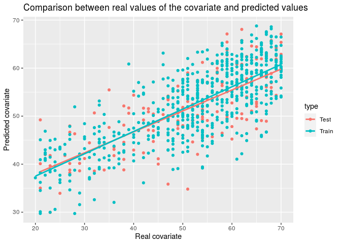

<!-- README.md is generated from README.Rmd. Please edit that file -->

# SuCoNets

<!-- badges: start -->

<!-- badges: end -->

Nowadays, the way to create a co-expression network is to use
Hierarchical Clustering. This package allows you to create a
co-expression network using the glmnet algorithm. In addition, the
network created will be relative to a covariate of the sample to be
studied, so we are creating a supervised coexpression network.

## Installation

You can install SuCoNets like so:

``` r
devtools::install_github("carmen-maria-hernandez/SuCoNets”)
```

## Example

Suppose we have an expression matrix, data, where the columns are blood
samples and the rows are genes, so that each sample is identified by the
numerical values taken by the genes. Suppose we also have a numeric
vector, age, with the age of each individual to whom each blood sample
corresponds.

An example of a typical execution of the functions contained in this
package would be as follows.

We start by normalizing the vector containing the age with the function
normalize and the expression matrix with the function scn and then
eliminate redundant predictors. Note that the function normalize
returns: first the mean of the vector we pass as parameter, then its
standard deviation and then the vector, which we pass as parameter,
normalized.

``` r
library(SuCoNets)
age <- normalize(age)
m <- age[1]
d <- age[2]
age <- age[-c(1,2)]
data <- scn(data)
data <- rRedundantPredictors(data)
```

Next, we calculate which seed produces the data partition (training set
and test set) that gives the best results when running *GLMNET*
algorithm, so we can use that partition to run *GLMNET* algorithm. With
the function detectGenes we get the genes that *GLMNET* algorithm has
selected as important for age prediction

``` r
seed <- bestSeed(data,age)

cvfit <- glmnetGenes(data,age, seed)
glmnet::print.cv.glmnet(cvfit)
#> 
#> Call:  glmnet::cv.glmnet(x = data.train, y = covariate.train, alpha = 1,      family = "gaussian") 
#> 
#> Measure: Mean-Squared Error 
#> 
#>      Lambda Index Measure      SE Nonzero
#> min 0.03856    51  0.6071 0.03249      98
#> 1se 0.07747    36  0.6360 0.03471      27

genes.seleccionados <- detectGenes(data,age,cvfit)
```

Now let’s look at a scatter plot with the predicted age and the actual
age of both the test set and the train set. Note that the mean and
standard deviation of the age must be passed as parameters to this
function to be able to see in the scatter plot the ages in the real
ranges.

``` r
comparisonActualPredictedCovariate(data, age, m, d, cvfit, seed)
#> `geom_smooth()` using formula 'y ~ x'
```



We can also obtain a representation of all individuals in the analysis
according to their age. Each individual will be represented by a dot.
The blue dots represent the youngest individuals and the red dots
represent the oldest. The individuals whose age is between these two,
will be represented by a color contained in the gradient of these two
colors. In order to perform this representation, we use the genes that
the GLMNET algorithm has selected, we perform a PCA and we plot the
first two components of this PCA, which are the ones that explain the
most variability in the data.

``` r
distributionIndividualsCovariate (data, age, genes.seleccionados, m,d)
```


Finally, we compute the co-expression network with the function
coexpressionNetwork.

``` r
all.genes <- coexpressionNetwork(data, genes.seleccionados)
```
