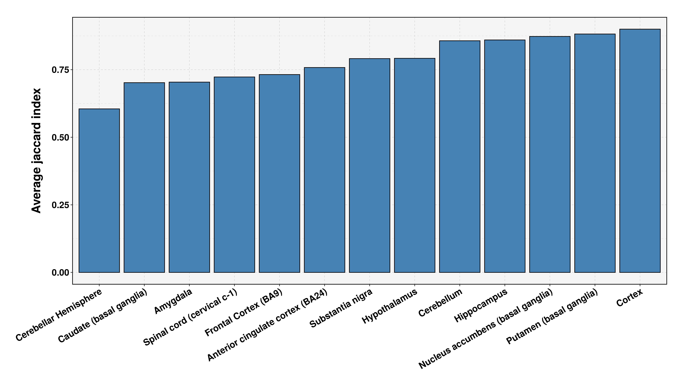
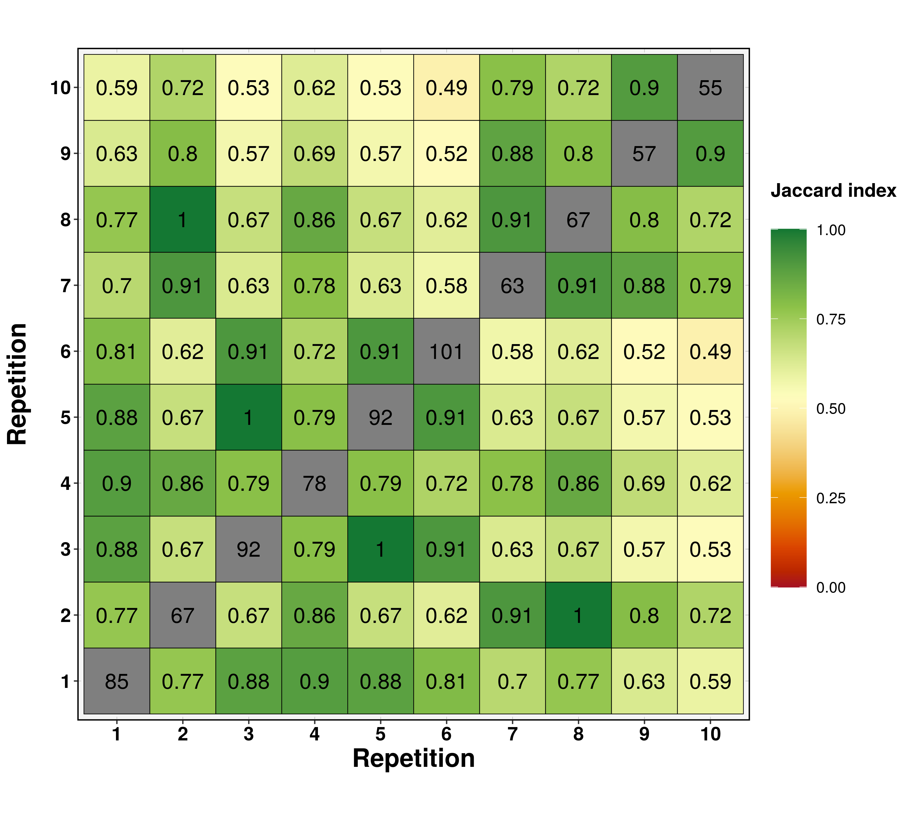

-   [`Glmnet` stability studies](#glmnet-stability-studies)
    -   [Prerequisites](#prerequisites)
    -   [Steps](#steps)
    -   [Coincidence matrix:](#coincidence-matrix)

`Glmnet` stability studies
==========================

Prerequisites
-------------

This tutorial requires for the libraries `magrittr` for its pipe-like
operator, `dplyr`, `jaccard` and `ggplot2`. We also automatically load
the `doParallel` and `foreach` libraries. `jaccard`

``` r
library(CovCoExpNets)
#> Loading required package: glmnet
#> Loading required package: Matrix
#> Loaded glmnet 4.1-2
#> Loading required package: foreach
#> Loading required package: doParallel
#> Loading required package: iterators
#> Loading required package: parallel
library(magrittr)
library(dplyr)
#> 
#> Attaching package: 'dplyr'
#> The following objects are masked from 'package:stats':
#> 
#>     filter, lag
#> The following objects are masked from 'package:base':
#> 
#>     intersect, setdiff, setequal, union
library(jaccard)
library(ggplot2)

doParallel::registerDoParallel(13)
```

The file requirements are the data and age generated in the data
extraction pipeline.

``` r
brain_data.path <- "~/GTEx_data/"

data = readRDS(paste0(brain_data.path, "data.combined.rds"))
age = readRDS(paste0(brain_data.path, "age.combined.rds"))

m <- lapply(age, function(x) x$mean)
d <- lapply(age, function(x) x$standard.deviation)
age <- lapply(age, function(x) x$covariate)
```

Steps
-----

### Step 1: `Glmnet` repetitions

First, we will calculate the glmnet repetitions a total of *t=40* times,
which should be enough to estimate with a high precision the stability.

``` r
genes.freq.40 = CovCoExpNets::geneFrequency(data, age, t = 40, seed = 1796)
```

### Step 2: Generation of the jaccard index matrix

Then, we generate a matrix with the repetitions as rows and columns, and
the values of the intersection as the jaccard index between the two
repetitions. We use the `measureStabilityJaccard` function:

``` r
glmnet.stability.matrix = measureStabilityJaccard(genes.freq.40)
```

### Step 3: Stability results

We can calculate the average stability of the different tissues using
the following function:

``` r
calculateAverageStability <- function(glmnet.stability.matrix, round.digits = 3){
  return.list = is(glmnet.stability.matrix, "list")
  if(!return.list){
    glmnet.stability.matrix = list(glmnet.stability.matrix)
  }
  
  df.stability = foreach(i = 1:length(glmnet.stability.matrix), .combine = "rbind") %do%{
    tissue.name = if(return.list) names(glmnet.stability.matrix)[i] else "Condition"
    
    df = CovCoExpNets::summaryVars(reshape2::melt(glmnet.stability.matrix[[i]], value.name = "stability"), variable = "stability", na.rm = T) %>%
      mutate(Tissue = tissue.name, .before = counter) %>% 
      select(Tissue, stability, ci) %>% mutate(across(where(is.numeric), round, round.digits))
    df
  }
  
  return(df.stability)
}

df.stability = calculateAverageStability(glmnet.stability.matrix, round.digits = 3)

df.stability
#>                               Tissue stability    ci
#> 1                           Amygdala     0.704 0.010
#> 2   Anterior cingulate cortex (BA24)     0.758 0.009
#> 3            Caudate (basal ganglia)     0.702 0.009
#> 4              Cerebellar Hemisphere     0.605 0.012
#> 5                         Cerebellum     0.857 0.006
#> 6                             Cortex     0.900 0.006
#> 7               Frontal Cortex (BA9)     0.732 0.008
#> 8                        Hippocampus     0.860 0.008
#> 9                       Hypothalamus     0.792 0.009
#> 10 Nucleus accumbens (basal ganglia)     0.873 0.005
#> 11           Putamen (basal ganglia)     0.882 0.005
#> 12        Spinal cord (cervical c-1)     0.723 0.009
#> 13                  Substantia nigra     0.791 0.007
#df.stability = df.stability %>% mutate(Samples = sapply(data, function(x) dim(x)[2]), Genes = sapply(data, function(x) dim(x)[1]))
#cor.test(df.stability$stability, df.stability$Samples)
#cor.test(df.stability$stability, df.stability$Genes)
```

These results show the average jaccard index for every tissue. We can
plot these results in barplots and compare the different tissues:

``` r
plot = ggplot(df.stability, aes(x = reorder(Tissue, stability), y = stability)) +
  geom_bar(stat = "identity", position = "dodge", color = "black", show.legend = T, fill = "steelblue") +
  labs(y = "Average jaccard index") + 
  theme(plot.title = element_text(size = 22, face = "bold"),
          panel.border = ggplot2::element_rect(colour = "black", fill = NA, size = 1),
          axis.text.x = ggplot2::element_text(face = "bold", color = "black", angle = 30, size = 15, hjust = 1),
          axis.text.y = ggplot2::element_text(face = "bold", color = "black", size = 15),
          axis.title.x = ggplot2::element_blank(),
          axis.title.y = ggplot2::element_text(face = "bold", size = 20, margin=margin(0,15,0,0)),
          panel.grid.minor = element_line(color = "gray", size = 0.1, linetype = 2),
          panel.grid.major = element_line(color = "gray", size = 0.2, linetype = 2),
          panel.background = element_rect(fill = "#F5F5F5"),
          aspect.ratio = 9/20,
          legend.title = element_text(size=20),
          legend.text = element_text(size=15),
          plot.margin = unit(c(1,1,1,1.5), "cm")
        )
plot
```



``` r
#ggsave("Stability_plots/Comparison.png", plot, width = 16, height = 9, dpi = 300, units = "in")
```

Coincidence matrix:
-------------------

We can also represent the heatplots with the coincidence matrices. This
is an example for the Spinal cord tissue:

``` r
genes.freq.10 = CovCoExpNets::geneFrequency(data$`Spinal cord (cervical c-1)`, age$`Spinal cord (cervical c-1)`, t = 10, seed = 1796)
plotAllSimilarity(genes.freq.10, diag = "genes", show.text = T)
```



We can also use the `output.path` argument to save the figure into the
given location.
